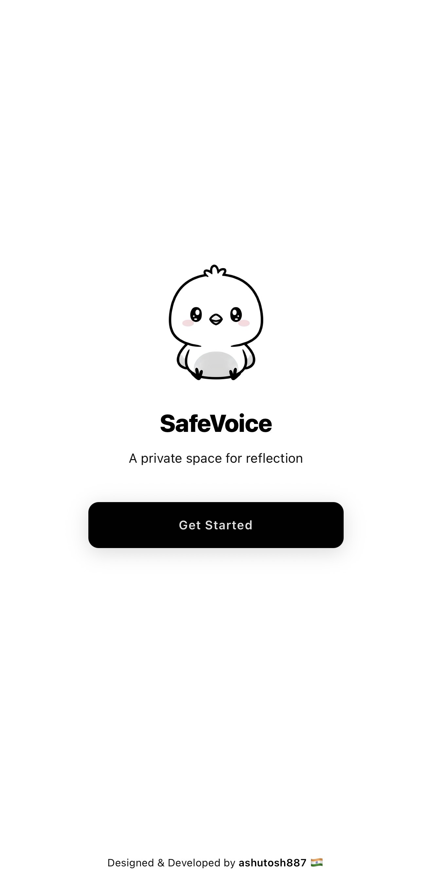
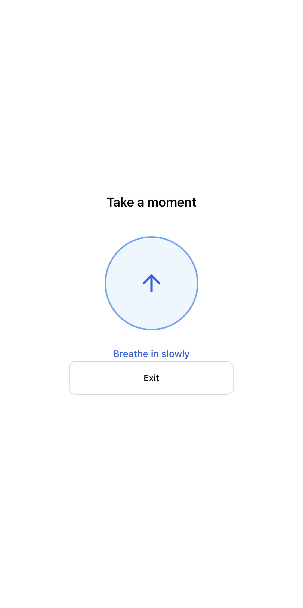
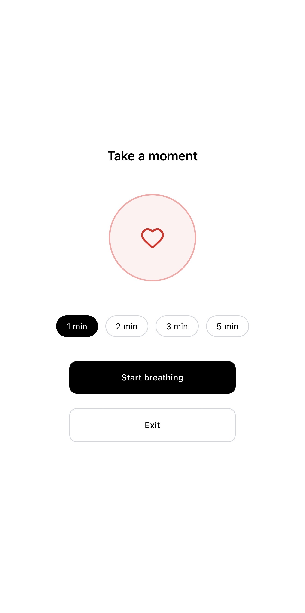
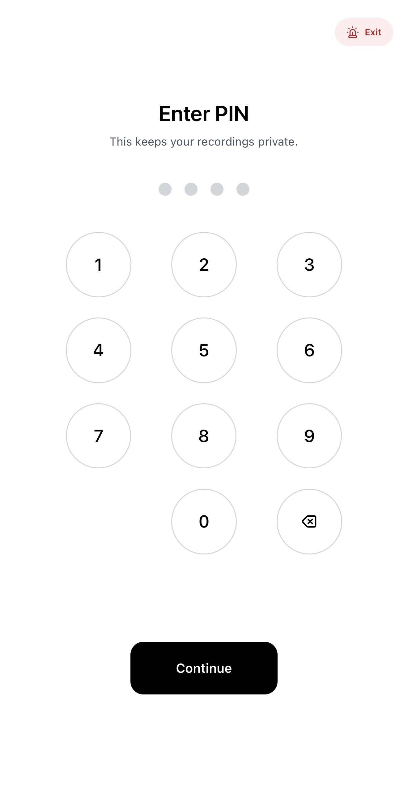
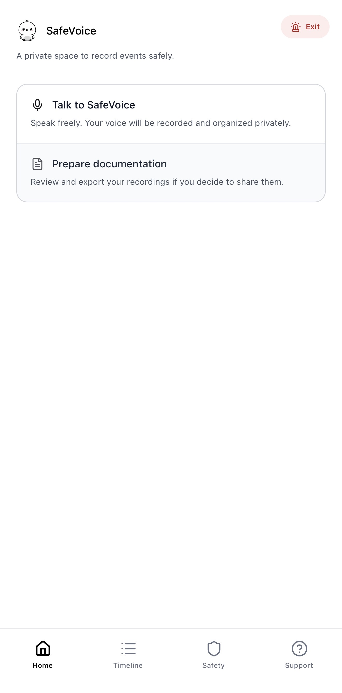
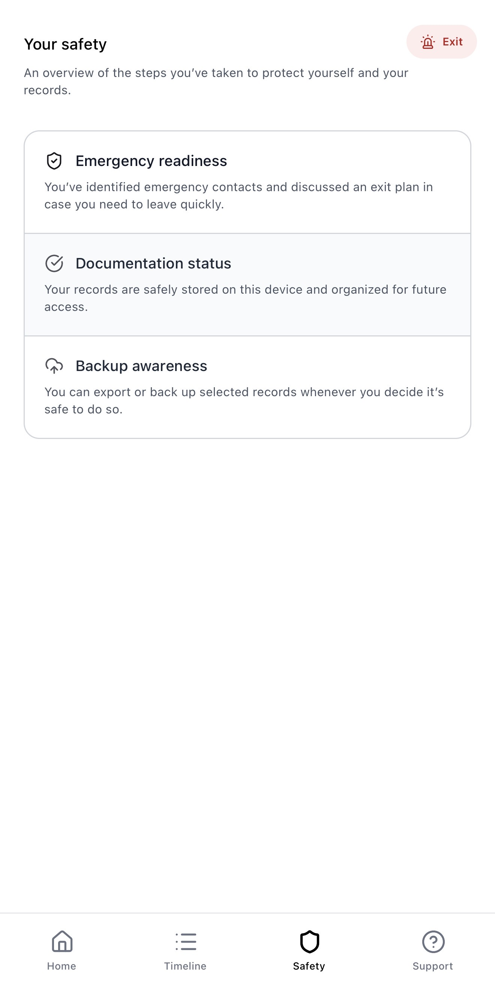
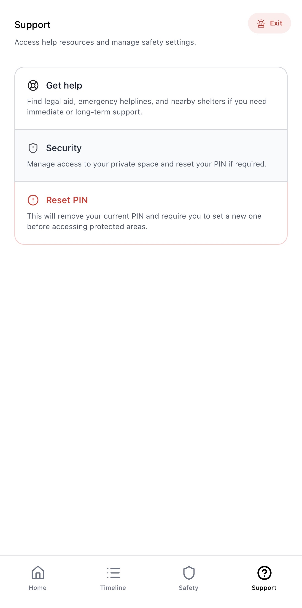

# SafeVoice
AI-Powered Legal Evidence Documentation for Victims of Abuse

SafeVoice is a voice-first AI companion designed to help victims of abuse safely document incidents, preserve evidence, and prepare for legal action — without typing, legal expertise, or putting themselves at risk.

The app is built with safety-first principles, including a decoy interface, PIN-protected access, and instant exit mechanisms, making it usable even in high-risk environments.

## The Problem

Most victims of abuse never report incidents.

Not because they do not want help — but because:
- Documenting evidence is unsafe
- Trauma makes writing and recall difficult
- Victims do not know what details are legally important
- Written journals can be discovered by an abuser
- Legal support is expensive and inaccessible

As a result, evidence is lost, escalation goes unnoticed, and victims remain trapped.

## The Solution

SafeVoice provides a private, secure space where victims can simply speak — and the system handles the rest.

It works quietly, looks harmless, and only reveals its real functionality when intentionally unlocked by the user.

## App Flow and Screens

### Landing Screen
Introduces SafeVoice and its purpose.

### Decoy Meditation Interface
This is the default interface shown when the app is opened.  
It appears as a harmless meditation or wellness app.

### Guided Meditation (Decoy Mode)
A real guided meditation experience powered by an AI meditation agent using ElevenLabs.  
This helps users regulate emotions while maintaining the decoy illusion.

### Secure Unlock (PIN Protection)
The real SafeVoice flow unlocks only after a deliberate long-press followed by PIN verification.

### Home Dashboard
Main dashboard after unlocking, providing access to documentation and history.

### Safety Controls
Quick exit and safety-first controls designed for high-risk situations.

### Incident Timeline
Chronological, secure evidence timeline showing documented incidents over time.

### Support and Guidance
Support screen offering reassurance and next-step guidance without forcing action.

## Core Features

### Decoy-First Safety Design
- App appears as a meditation or wellness app by default
- No visible recordings or suspicious UI
- Real functionality unlocks via long-press + PIN
- One-tap quick exit instantly returns to the decoy screen

### Voice-Based Incident Documentation
- Victims document incidents using natural speech
- No typing or writing required
- Designed for trauma-informed, low-cognitive-load use

### AI Transcription and Understanding
- Voice input is transcribed and analyzed automatically
- AI identifies what happened, when it happened, and key signals
- Users never need to think in legal terms

### Guided Follow-ups for Legal Readiness
- AI asks gentle, contextual follow-up questions
- Helps recall details commonly lost under stress
- Converts fragmented memories into usable evidence

### Risk and Crisis Detection
- Incidents are analyzed over time for escalation and repetition
- System adapts behavior when risk increases
- Designed to support prevention, not just documentation

### Secure Evidence Timeline
- Chronological, private evidence log
- Stored securely and encrypted
- Exportable only when the user chooses to do so

### Guided Meditation and Emotional Regulation
- AI-powered guided meditation agent
- Built using ElevenLabs for calm, empathetic voice guidance
- Provides real value while reinforcing the decoy design

## Technology Used

- ElevenLabs  
  Used for empathetic voice interaction, incident documentation, and the guided meditation agent.

- Google Gemini  
  Used for AI reasoning, narrative understanding, follow-up generation, evidence structuring, and pattern detection.

- Google Cloud  
  Used for secure, encrypted processing and storage of sensitive data.

- Confluent  
  Used for real-time event streaming to analyze incident patterns and detect escalation or crisis signals.

- Datadog  
  Used for system observability, reliability monitoring, and risk signal tracking.

Each technology supports safety, reliability, and intelligence — not vanity features.

## Impact

SafeVoice lowers the barrier to justice by:
- Prioritizing user safety above all else
- Preserving memory under trauma
- Turning lived experiences into usable evidence
- Helping victims prepare for legal or support systems without replacing them

## 🎥 Demo Video

